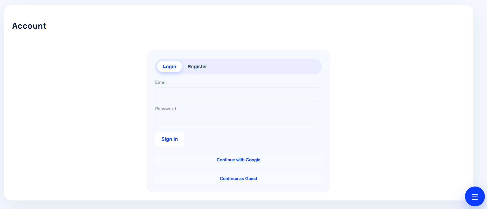
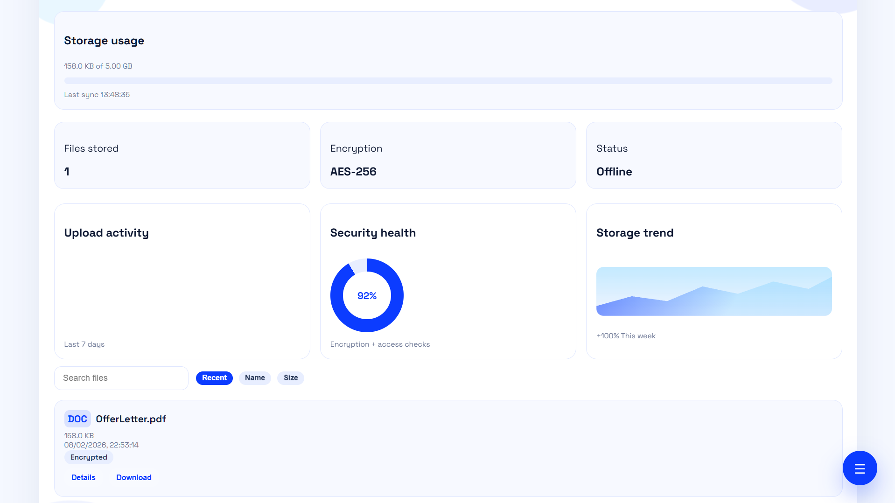
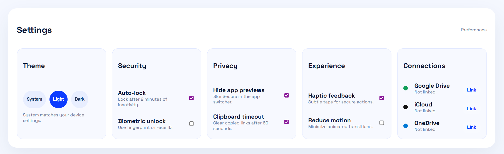
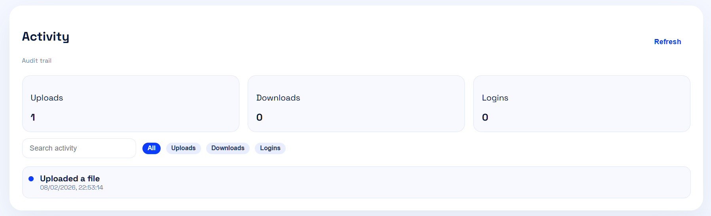

# Secura (SFSS)

Secure File Storage System (SFSS) — a secure, role-based file vault with AES encryption, audit logs, and a clean web UI.


## Highlights
- AES-256 encryption at rest (encrypt on upload, decrypt on download)
- Role-based access control (admin vs user)
- Audit logging for uploads, downloads, and logins
- Powerful file search + sorting (name, size, recent)
- Theme preferences (light/dark/system)
- Drive connections panel (Google Drive, iCloud, OneDrive placeholders)
- Web UI aligned with the mobile demo experience



## Project Structure
```
server_django/   Django backend (API, encryption, audit)
web/             Vite + React web app
src/             React Native mobile app (demo)
```



## Quick Start (Local)

### Backend (Django + MySQL)
```bash
cd server_django
venv\Scripts\python manage.py migrate
venv\Scripts\python manage.py runserver 0.0.0.0:4000
```

Seed demo accounts + sample files:
```bash
$env:PYTHONPATH="."
venv\Scripts\python scripts\seed.py
```

### Web (Vite + React)
```bash
cd web
npm install
npm run dev
```

The web app uses `/api` and proxies to the backend during development.


## Environment
Backend config lives in `server_django/.env`. Important keys:
- `DJANGO_SECRET_KEY`
- `DB_*` MySQL credentials
- `AES_KEY_BASE64` (keep stable to decrypt old files)
- `STORAGE_DIR`



## Deployment (Vercel + Railway)
See `DEPLOYMENT_CHECKLIST.md`.

## Demo Script
See `DEMO_SCRIPT.md`.



## License
MIT. See `LICENSE`.
